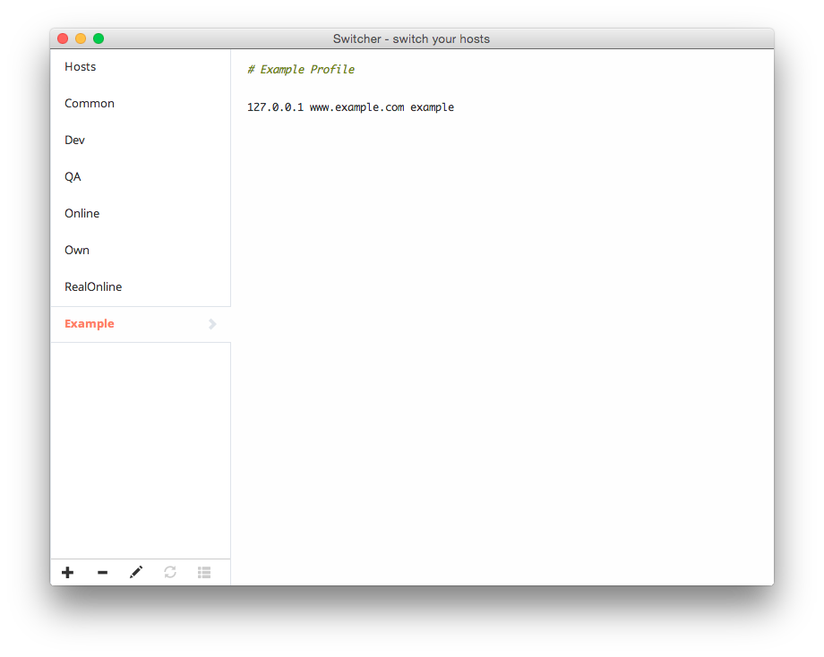
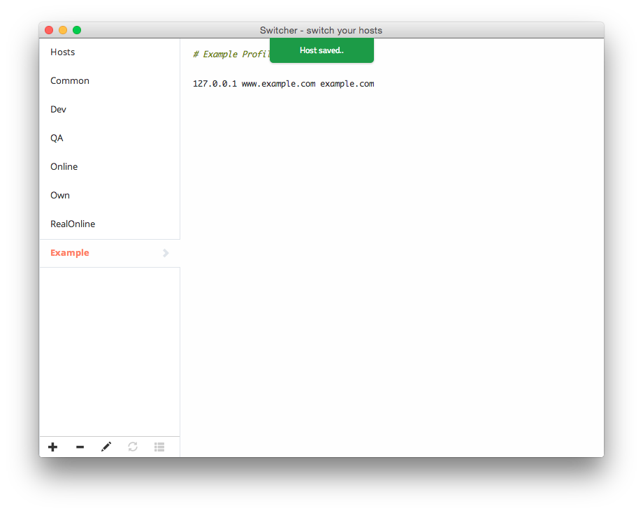
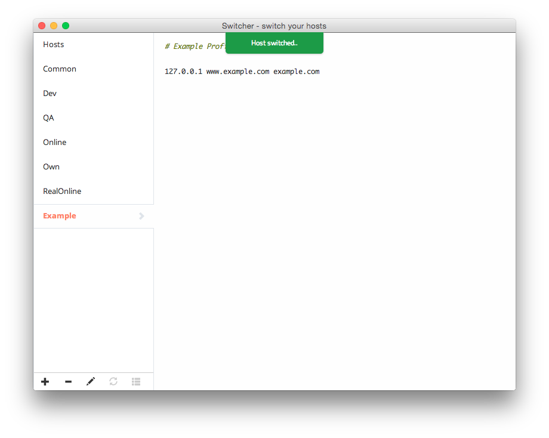

Switcher
========

*Switch your hosts gracefully.*

Switcher is based on [nw.js](https://github.com/nwjs/nw.js/), aiming to change hosts between different host profiles. Switcher need root password on Mac and administrator permissions on Windows. I won't collect your information.

### Download

Current version is **v1.0.4**

* MacOSX [百度云盘](http://pan.baidu.com/s/1o64zxyU) [Dropbox](https://www.dropbox.com/s/2d18aapji19xsa9/Switcher.1.0.4.zip?dl=0)

### Shortcuts

| Features	| Keys |
|----------------------	|-----:|
| Save Current Profile 	| ⌘S  	|
| New Profile          	| ⌘N  	|
| Choose First Profile 	| ⌘1  	|
| Next Profile         	| ⌃➞  	|
| Prev Profile         	| ⌃⇧➞ 	|

### Screenshot

