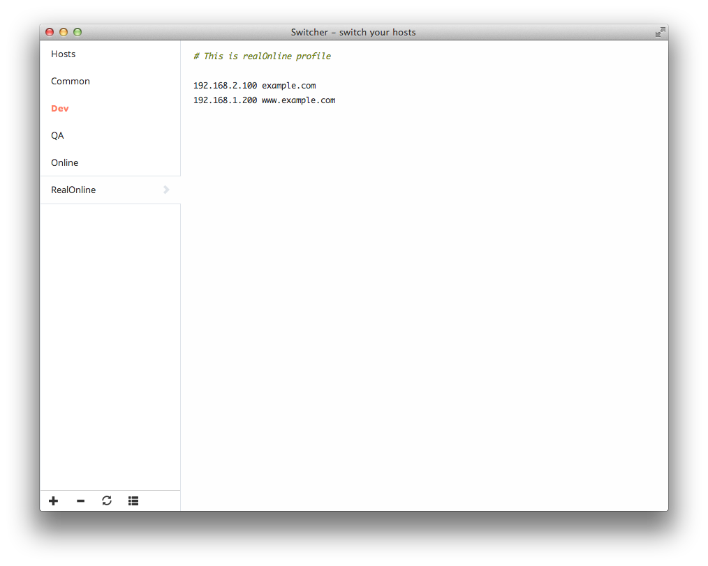

Switcher
========

Switcher lets switch your hosts gracefully, which is based on node-webkit.

### Downloads

* [Mac OS X v1.0.0](https://github.com/Witcher42/Switcher/releases/download/v1.0.0/Switcher.zip)

### Screenshots

